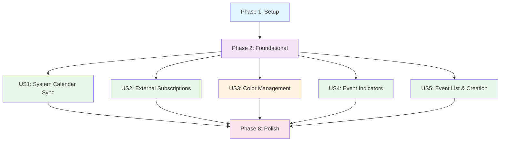

# Tasks: 日历事件订阅管理

**Branch**: `003-calendar-subscription` | **Date**: 2025-10-31
**Spec**: [spec.md](spec.md) | **Plan**: [plan.md](plan.md)
**Total Tasks**: 51 | **Parallel Opportunities**: 16

## Task Summary

| User Story | Priority | Tasks | Parallel Tasks | Test Criteria |
|------------|----------|-------|----------------|--------------|
| US1 - 系统日历同步 | P1 | 12 | 6 | 系统日历事件正确同步显示 |
| US2 - 外部订阅 | P1 | 11 | 4 | URI订阅解析和显示正常 |
| US3 - 颜色管理 | P2 | 8 | 3 | 自动颜色分配和用户自定义 |
| US4 - 事件标识 | P1 | 9 | 4 | 日期圆点标识准确显示 |
| US5 - 事件列表 | P1 | 9 | 3 | 事件列表查看和添加功能 |

## Implementation Strategy

**MVP Scope**: User Story 1 (系统日历同步) - 提供核心功能基础
**Delivery Strategy**: 按优先级增量交付，每个用户故事独立可测试
**Parallelization**: 充分利用并行任务提高开发效率

---

## Phase 1: Setup

**Goal**: 项目初始化和基础架构搭建
**Estimated Time**: 1-2 days

### Project Setup Tasks

- [X] T001 [P] 创建功能开发分支 `003-calendar-subscription`
- [X] T002 [P] 更新项目配置文件支持EventKit权限
- [X] T003 [P] 创建基础目录结构（Models/, Services/, ViewModels/, Views/）
- [X] T004 [P] 更新Info.plist添加日历权限描述

### Dependencies and Configuration

- [X] T005 配置Swift Package Manager依赖（如有需要）
- [X] T006 设置单元测试框架基础设施
- [X] T007 配置项目构建设置和编译选项

---

## Phase 2: Foundational Infrastructure

**Goal**: 实现所有用户故事的基础依赖
**Estimated Time**: 3-4 days
**Blocking**: 必须在用户故事实现前完成

### Core Data Models

- [X] T008 [P] 实现CalendarSubscription数据模型在 `MiniCal/Models/CalendarSubscription.swift`
- [X] T009 [P] 扩展DateEvent模型支持订阅功能在 `MiniCal/Models/DateEvent.swift`
- [X] T010 [P] 实现SyncStatus枚举在 `MiniCal/Models/SyncStatus.swift`
- [X] T011 [P] 实现CalendarEvent数据模型在 `MiniCal/Models/CalendarEvent.swift`
- [X] T012 [P] 扩展EventColor和EventType枚举在 `MiniCal/Models/EventColor.swift`

### Service Layer Foundations

- [X] T013 [P] 定义CalendarSubscriptionServiceProtocol协议在 `MiniCal/Services/Protocols/CalendarSubscriptionServiceProtocol.swift`
- [X] T014 [P] 定义CalendarEventServiceProtocol协议在 `MiniCal/Services/Protocols/CalendarEventServiceProtocol.swift`
- [X] T015 [P] 定义ColorManagementServiceProtocol协议在 `MiniCal/Services/Protocols/ColorManagementServiceProtocol.swift`
- [X] T016 [P] 实现权限管理器在 `MiniCal/Services/PermissionManager.swift`
- [X] T017 [P] 实现本地存储管理器在 `MiniCal/Services/LocalStorageManager.swift`

### ViewModel Foundation

- [X] T018 [P] 创建EventSubscriptionViewModel在 `MiniCal/ViewModels/EventSubscriptionViewModel.swift`
- [X] T019 [P] 扩展现有EventListViewModel支持订阅功能在 `MiniCal/ViewModels/EventListViewModel.swift`

---

## Phase 3: User Story 1 - 自动同步系统日历事件

**Goal**: 实现系统日历事件的自动同步和显示
**Priority**: P1 | **Estimated Time**: 4-5 days
**Independent Test**: 连接系统日历，验证事件正确读取和同步

### System Calendar Integration

- [X] T020 [US1] 实现系统日历检测功能在 `MiniCal/Services/SystemCalendarService.swift`
- [X] T021 [US1] 实现CalendarSubscriptionService基础类在 `MiniCal/Services/CalendarSubscriptionService.swift`
- [X] T022 [P] [US1] 实现系统日历权限请求在 `MiniCal/Services/PermissionManager.swift`
- [ ] T023 [P] [US1] 创建系统日历同步逻辑在 `MiniCal/Services/CalendarSyncService.swift`

### Data Sync Implementation

- [X] T024 [US1] 实现EventKit事件读取在 `MiniCal/Services/EventKitService.swift`
- [X] T025 [US1] 实现增量同步机制在 `MiniCal/Services/IncrementalSyncService.swift`
- [X] T026 [P] [US1] 实现事件缓存管理在 `MiniCal/Services/EventCacheManager.swift`
- [X] T027 [P] [US1] 实现同步状态监控在 `MiniCal/Services/SyncStatusMonitor.swift`

### UI Components

- [ ] T028 [US1] 创建日历事件显示组件在 `MiniCal/Views/CalendarEventView.swift`
- [ ] T029 [US1] 实现CalendarViewModel事件加载逻辑在 `MiniCal/ViewModels/CalendarViewModel.swift`
- [ ] T030 [US1] 集成事件显示到主日历界面在 `MiniCal/Views/CalendarView.swift`
- [ ] T031 [US1] 实现自动同步触发机制在 `MiniCal/App/MenuBarController.swift`

---

## Phase 4: User Story 2 - URI订阅外部日历

**Goal**: 实现外部日历URI订阅功能
**Priority**: P1 | **Estimated Time**: 3-4 days
**Independent Test**: 添加URI订阅源，验证事件正确解析和显示

### External Subscription Logic

- [ ] T032 [US2] 实现URI验证和重复订阅检测在 `MiniCal/Services/SubscriptionValidationService.swift`
  - URL 格式验证（支持 http/https/webcal 协议）
  - 检测是否已存在相同 URI 的订阅源
  - 提示用户已存在重复订阅（显示订阅名称和添加时间）
- [ ] T033 [US2] 实现iCal解析器在 `MiniCal/Services/ICalParser.swift`
  - 支持 iCalendar 2.0 格式（RFC 5545）
  - 必需字段解析：VEVENT, DTSTART, DTEND, SUMMARY
  - 可选字段解析：DESCRIPTION, LOCATION, RRULE（重复规则）
  - 错误处理：格式不符时返回具体错误信息
- [ ] T034 [P] [US2] 实现外部日历网络请求在 `MiniCal/Services/ExternalCalendarService.swift`
  - 支持 HTTP/HTTPS 请求，处理重定向
  - 使用 `If-Modified-Since` 头优化增量同步
  - 超时设置：30 秒连接超时，60 秒读取超时
- [ ] T034.1 [US2] 实现订阅失效检测和恢复提示在 `MiniCal/Services/SubscriptionHealthMonitor.swift`
  - 记录连续失败次数（3 次失败标记为"不健康"）
  - 在订阅列表中显示失效状态图标（⚠️ 黄色警告）
  - 提供"重新验证"和"删除订阅"操作入口
- [ ] T035 [P] [US2] 实现订阅源管理UI在 `MiniCal/Views/SubscriptionManagerView.swift`

### Subscription Management

- [ ] T036 [US2] 扩展CalendarSubscriptionService支持外部订阅在 `MiniCal/Services/CalendarSubscriptionService.swift`
- [ ] T036.1 [US2] 实现订阅源编辑功能在 `MiniCal/Services/CalendarSubscriptionService.swift`
- [ ] T037 [US2] 实现订阅源添加和删除功能在 `MiniCal/Services/SubscriptionService.swift`
- [ ] T038 [US2] 创建订阅源列表组件在 `MiniCal/Views/SubscriptionListView.swift`
- [ ] T039 [US2] 实现订阅源详情页面在 `MiniCal/Views/SubscriptionDetailView.swift`
- [ ] T040 [US2] 集成外部订阅到主界面在 `MiniCal/Views/SettingsView.swift`
- [ ] T041 [US2] 实现系统级订阅引导功能在 `MiniCal/Services/SystemSubscriptionGuide.swift`

---

## Phase 5: User Story 3 - 日历颜色标识管理

**Goal**: 实现日历订阅源的颜色管理功能
**Priority**: P2 | **Estimated Time**: 2-3 days
**Independent Test**: 验证颜色自动分配和用户自定义功能

### Color Management

- [ ] T042 [US3] 实现ColorAssignmentService颜色分配服务在 `MiniCal/Services/ColorAssignmentService.swift`
- [ ] T043 [US3] 实现智能颜色分配算法在 `MiniCal/Services/SmartColorAssignment.swift`
- [ ] T044 [P] [US3] 创建颜色选择器组件在 `MiniCal/Views/ColorPickerView.swift`
- [ ] T045 [P] [US3] 实现颜色调色板管理在 `MiniCal/Services/ColorPaletteService.swift`

### UI Integration

- [ ] T046 [US3] 在订阅管理中集成颜色选择在 `MiniCal/Views/SubscriptionManagerView.swift`
- [ ] T047 [US3] 实现颜色预览和更新功能在 `MiniCal/ViewModels/SubscriptionManagerViewModel.swift`
- [ ] T048 [US3] 在日历视图中显示颜色标识在 `MiniCal/Views/CalendarView.swift`
- [ ] T049 [US3] 实现颜色冲突检测和解决在 `MiniCal/Services/ColorConflictResolver.swift`

---

## Phase 6: User Story 4 - 事件日期可视化标识

**Goal**: 实现有事件日期的圆点标识显示
**Priority**: P1 | **Estimated Time**: 2-3 days
**Independent Test**: 验证日期圆点标识准确显示和隐藏

### Event Indicators

- [ ] T050 [US4] 实现事件日期检测逻辑在 `MiniCal/Services/EventDateDetectionService.swift`
- [ ] T051 [US4] 创建圆点标识组件在 `MiniCal/Views/EventIndicatorView.swift`
- [ ] T052 [P] [US4] 实现多事件颜色标识排列在 `MiniCal/Views/MultiEventIndicatorView.swift`
- [ ] T053 [P] [US4] 优化大量事件的显示性能在 `MiniCal/Services/EventDisplayOptimizer.swift`

### Calendar Integration

- [ ] T054 [US4] 在CalendarView中集成日期标识在 `MiniCal/Views/CalendarView.swift`
- [ ] T055 [US4] 实现日期标识的响应式更新在 `MiniCal/ViewModels/CalendarViewModel.swift`
- [ ] T056 [US4] 添加标识显示设置选项在 `MiniCal/Views/SettingsView.swift`
- [ ] T057 [US4] 实现标识动画和交互效果在 `MiniCal/Views/EventIndicatorView.swift`
- [ ] T058 [US4] 优化标识在不同主题下的显示在 `MiniCal/Views/ThemedEventIndicatorView.swift`

---

## Phase 7: User Story 5 - 事件列表查看和添加

**Goal**: 实现事件列表显示和本地事件创建功能
**Priority**: P1 | **Estimated Time**: 3-4 days
**Independent Test**: 验证事件列表显示和事件创建功能

### Event List Display

- [ ] T059 [US5] 实现EventListViewModel在 `MiniCal/ViewModels/EventListViewModel.swift`
- [ ] T060 [US5] 创建事件列表视图组件在 `MiniCal/Views/EventListView.swift`
- [ ] T061 [P] [US5] 实现事件列表项组件在 `MiniCal/Views/EventRowView.swift`
- [ ] T062 [P] [US5] 添加列表滚动和分页功能在 `MiniCal/Views/ScrollableEventListView.swift`

### Event Creation

- [ ] T063 [US5] 实现CalendarEventService事件创建服务在 `MiniCal/Services/CalendarEventService.swift`
- [ ] T064 [US5] 创建事件创建表单界面在 `MiniCal/Views/EventCreationView.swift`
- [ ] T065 [P] [US5] 实现事件数据验证在 `MiniCal/Services/EventValidationService.swift`
- [ ] T066 [P] [US5] 添加事件模板功能在 `MiniCal/Services/EventTemplateService.swift`

### Integration and Polish

- [ ] T067 [US5] 集成事件列表到主日历界面在 `MiniCal/Views/CalendarView.swift`
- [ ] T068 [US5] 实现事件详情显示在 `MiniCal/Views/EventDetailView.swift`
- [ ] T069 [US5] 添加事件编辑功能在 `MiniCal/Views/EventEditView.swift`
- [ ] T069.1 [US5] 实现事件列表中的添加按钮在 `MiniCal/Views/EventListView.swift`
- [ ] T069.2 [US5] 集成事件创建到事件列表底部在 `MiniCal/Views/EventListView.swift`

---

## Phase 8: Cross-Cutting Concerns & Polish

**Goal**: 完善错误处理、性能优化和用户体验
**Priority**: All | **Estimated Time**: 2-3 days

### Error Handling and Resilience

- [ ] T070 [P] 实现全局错误处理机制在 `MiniCal/Services/ErrorHandler.swift`
- [ ] T071 [P] 添加网络连接监控在 `MiniCal/Services/NetworkMonitor.swift`
- [ ] T071.1 [P] 实现网络异常时的缓存降级逻辑在 `MiniCal/Services/OfflineManager.swift`
  - 检测网络状态，失败时自动切换到缓存模式
  - 在 UI 中显示"离线模式"指示器
  - 网络恢复后自动触发后台同步
- [ ] T072 [P] 实现离线持久化缓存策略在 `MiniCal/Services/EventCacheManager.swift`
  - 扩展 T026 的内存缓存为持久化缓存（使用本地文件存储）
  - 设置缓存过期策略（默认 7 天）
- [ ] T073 [P] 添加同步失败重试机制在 `MiniCal/Services/SyncRetryManager.swift`

### Performance Optimization

- [ ] T074 [P] 实现事件缓存优化在 `MiniCal/Services/EventCacheOptimizer.swift`
- [ ] T075 [P] 优化大量事件的UI性能在 `MiniCal/Views/OptimizedEventListView.swift`
- [ ] T076 [P] 实现内存管理和清理在 `MiniCal/Services/MemoryManager.swift`
- [ ] T077 [P] 添加性能监控和报告在 `MiniCal/Services/PerformanceMonitor.swift`

### User Experience Polish

- [ ] T078 [P] 添加加载指示器和进度反馈在 `MiniCal/Views/LoadingViews.swift`
- [ ] T079 [P] 实现用户引导和帮助提示在 `MiniCal/Views/UserGuidanceView.swift`
- [ ] T080 [P] 优化界面响应性和动画效果在 `MiniCal/Views/AnimationComponents.swift`
- [ ] T081 [P] 实现设置页面的订阅管理界面在 `MiniCal/Views/SettingsView.swift`

### Testing and Quality Assurance

- [ ] T082 [P] 编写核心服务的单元测试在 `MiniCal/Tests/Unit/Services/`
- [ ] T083 [P] 编写ViewModel的单元测试在 `MiniCal/Tests/Unit/ViewModels/`
- [ ] T084 [P] 编写UI组件的单元测试在 `MiniCal/Tests/Unit/Views/`
- [ ] T085 [P] 编写集成测试在 `MiniCal/Tests/Integration/`
- [ ] T086 [P] 编写UI自动化测试在 `MiniCal/Tests/UI/`

---

## Dependencies and Execution Order



### Critical Path

1. **Phase 1** (T001-T007) → **Phase 2** (T008-T019) → **US1** (T020-T031)
2. **US1完成后**可以并行开始**US2**、**US4**、**US5**
3. **US3**（颜色管理）可以在**US1**完成后独立进行
4. **Phase 8**在所有用户故事完成后进行

### Parallel Execution Opportunities

**Maximum Parallel Tasks**: 15 tasks can be executed simultaneously in ideal conditions

**Phase 1 Parallel**: T001-T007 (all parallel)
**Phase 2 Parallel**: T008-T019 (models & services can be parallel)
**User Story Parallel**: Within each story, UI components can be developed in parallel with services

**Example Parallel Execution**:
```bash
# Phase 2 - Maximum Parallelization
T008 & T009 & T010 & T011 & T012 &  # Data Models (parallel)
T013 & T014 & T015 &                 # Protocol definitions (parallel)
T016 & T017 & T018 & T019           # Services and ViewModels (parallel)
```

---

## Testing Strategy

### Unit Tests Coverage Requirements

- **Services**: 90%+ code coverage
- **ViewModels**: 85%+ code coverage
- **Models**: 95%+ code coverage
- **UI Components**: 70%+ code coverage

### Integration Test Scenarios

1. **System Calendar Sync**: 验证完整的事件同步流程
2. **External Subscription**: 验证URI订阅的完整生命周期
3. **Color Management**: 验证颜色分配和用户自定义
4. **Event Creation**: 验证本地事件创建和管理
5. **Error Recovery**: 验证各种错误场景的处理

### UI Test Scenarios

1. **用户授权流程**: 系统日历权限请求和处理
2. **订阅管理**: 添加、删除、配置订阅源
3. **事件交互**: 查看、创建、编辑事件
4. **设置界面**: 颜色管理和偏好设置

---

## Risk Mitigation

### High-Risk Areas

1. **EventKit API Changes**: 新版本macOS可能有API变更
   - **Mitigation**: 使用版本检查和兼容性处理
   - **Task**: T022 includes version compatibility

2. **External Subscription Reliability**: 网络依赖和格式兼容性
   - **Mitigation**: 实现健壮的错误处理和重试机制
   - **Task**: T032, T034 include error handling

3. **Performance at Scale**: 大量订阅源和事件可能影响性能
   - **Mitigation**: 实现智能缓存和分页加载
   - **Task**: T026, T074, T075 address performance

### Quality Gates

Each phase must pass the following quality gates before proceeding:

1. **Code Review**: All code must pass peer review
2. **Unit Tests**: Minimum coverage requirements met
3. **Integration Tests**: Critical user flows tested
4. **Performance**: Response time requirements met
5. **Constitution Compliance**: Design principles followed

---

## Success Criteria

### Phase Completion Criteria

- **Phase 1**: Project structure ready, all dependencies configured
- **Phase 2**: All models and service contracts implemented
- **User Stories**: Independent test criteria met, functional requirements satisfied
- **Final Phase**: All cross-cutting concerns addressed, quality gates passed

### Feature Acceptance Criteria

All success criteria from [spec.md](spec.md) must be met:

- SC-001: 30秒内完成首次系统日历授权和同步
- SC-002: 外部日历URI订阅成功率不低于95%
- SC-003: 事件同步延迟不超过5分钟
- SC-004: 颜色区分准确率达到100%
- SC-005: 有事件日期的标识准确率达到98%以上
- SC-006: 事件列表加载时间不超过2秒
- SC-007: 新事件添加成功率不低于99%
- SC-008: 支持10个以上日历订阅源
- SC-009: 单日100+事件流畅显示
- SC-010: 用户满意度85%以上

---

## Notes

- **MVP Focus**: Start with User Story 1 for minimum viable product
- **Incremental Delivery**: Each user story delivers independent value
- **Parallel Development**: Leverage parallel tasks to reduce development time
- **Quality First**: Maintain high code quality throughout development
- **User Feedback**: Regular user testing and feedback integration

*Last Updated: 2025-10-31*